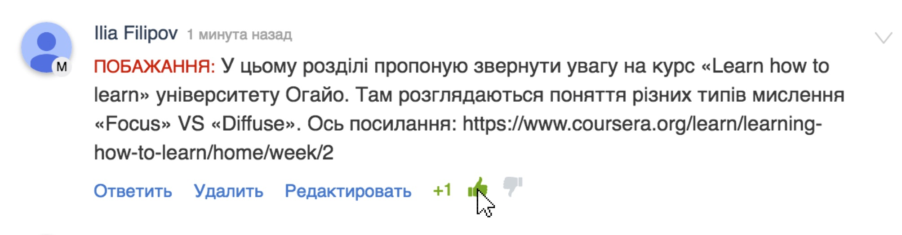

# Зміст розділу
1. [Звернення до громадськості](#zvernennya)
2. [Інструкція з використання](#instruction)
3. [Вступне опитування](#vstup)
4. [Програма з математики для молодшої школи](#programa)

Звернення до громадськості {#zvernennya}
--

Вітаємо на проекті відкритого обговорення програми з математики для молодшої школи.

Інструкція з використання платформи {#instruction}
--
У даному відеофрагменті ми розповімо у чому полягає суть проекту та як використовувати функціонал платформи для відкритих обговорень програм.

<iframe align="center" width="560" height="315" src="https://www.youtube.com/embed/V_Cii41-v-w" frameborder="0" allowfullscreen></iframe>

Звертаємо вашу увагу на систему голосування у коментарях. Чим більше позитивних відгуків стосовно коментаря, тим швидше модератори звернуть на нього увагу і зроблять акцент, щоби більше людей змогли одразу ознайомитися з корисною інформацією. Також найбільш позитивні коментарі будуть розглядатися у першу чергу експертною комісією.

Не забувайте, що на платформі заборонені образи, порушення прав і свобод громадян України, нецензурна лексика.

Вступне опитування {#vstup}
--
У попередньому пункті ви ознайомилися з функціоналом платформи та суттю проекту публічних обговорень програм для молодшої школи. Для нас дуже важливо, аби ви висловились стосовно запропонованої ідеї та відповіли на декілька запитань перед початком роботи з програмою. Пройдіть, будь ласка, вступне опитування. Його результати допоможуть нам покращувати українську освіту разом, у найбільш ефективний спосіб. 

Зміст програми {#programa}
--

1. [Пояснювальна записка](poyasnyuvalna_zapiska.md)
* [Коло читання](kolo_chitannya.md)
* [Формування і розвиток навички читання](formuvannya_i_rozvitok_navichki_chitannya.md)
* [Літературознавча пропедевтика](literaturoznavcha_propedevtika.md)
* [Досвід читацької діяльності](dosvid_chitatskoyi_diyalnosti.md)
   1. [Особливості опрацювання художнього твору](osoblivosti_opratsyuvannya_khudozhnogo_tvoru.md)
   * [Робота з науково-художніми творами](robota_z_naukovo-khudozhnimi_tvorami.md)
* [Робота з дитячою книжкою; робота з інформацією](robota_z_dityachoyu_knizhkoyu_robota_z_informatsiyeyu.md)
* [Розвиток творчої діяльності учнів на основі прочитаного](rozvitok_tvorchoyi_diyalnosti_uchniv_na_osnovi_prochitanogo.md)

    <a href="http://hypercomments.com" class="hc-link" title="comments widget">comments powered by HyperComments</a>

